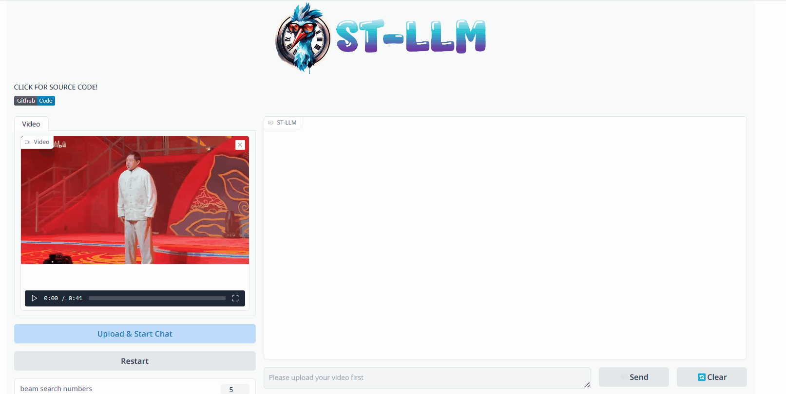
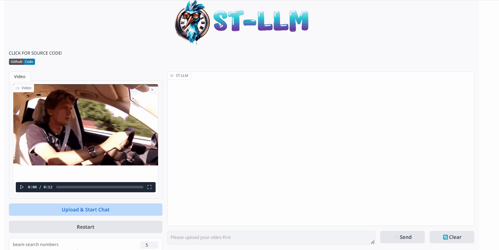
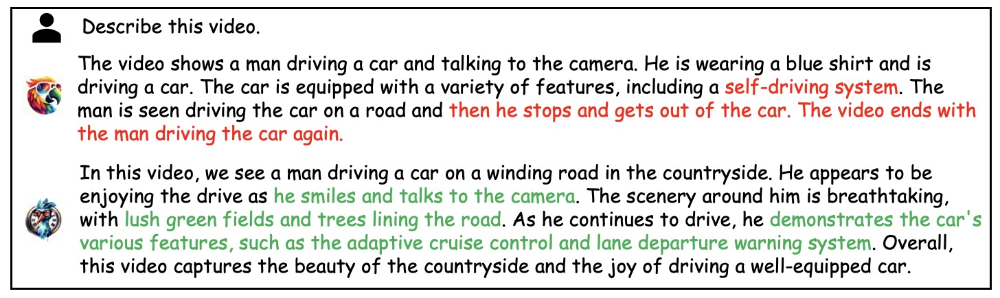
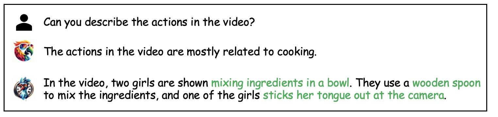
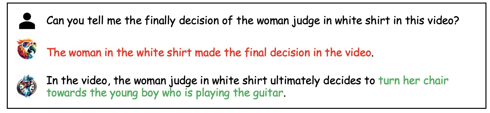
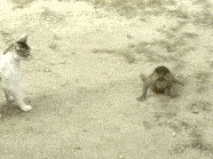
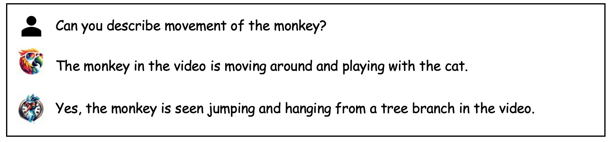
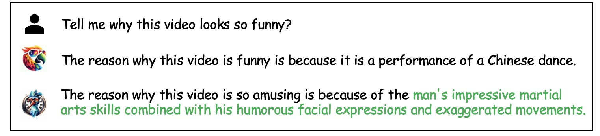

<p align="center" width="100%">
<a target="_blank"></a>
</p>

<h2 align="center"> <a href="https://arxiv.org/abs/2404.00308">ST-LLM: Large Language Models Are Effective Temporal Learners</a></h2>

<h5 align=center>

[](https://huggingface.co/farewellthree/ST_LLM_weight/tree/main)
[](https://arxiv.org/abs/2404.00308)
[](https://github.com/farewellthree/ST-LLM/blob/main/LICENSE)
</h5>

[](https://paperswithcode.com/sota/video-question-answering-on-mvbench?p=st-llm-large-language-models-are-effective)
[](https://paperswithcode.com/sota/video-based-generative-performance?p=st-llm-large-language-models-are-effective)
[](https://paperswithcode.com/sota/video-based-generative-performance-1?p=st-llm-large-language-models-are-effective)
[](https://paperswithcode.com/sota/video-based-generative-performance-5?p=st-llm-large-language-models-are-effective)
[](https://paperswithcode.com/sota/video-based-generative-performance-3?p=st-llm-large-language-models-are-effective)
[](https://paperswithcode.com/sota/video-based-generative-performance-2?p=st-llm-large-language-models-are-effective)
[](https://paperswithcode.com/sota/video-based-generative-performance-4?p=st-llm-large-language-models-are-effective)
[](https://paperswithcode.com/sota/zeroshot-video-question-answer-on-activitynet?p=st-llm-large-language-models-are-effective)
[](https://paperswithcode.com/sota/zeroshot-video-question-answer-on-msrvtt-qa?p=st-llm-large-language-models-are-effective)
[](https://paperswithcode.com/sota/zeroshot-video-question-answer-on-msvd-qa?p=st-llm-large-language-models-are-effective)

## News :loudspeaker:

* **[2024/3/28]**  All codes and weights are available now! Welcome to watch this repository for the latest updates.

## Introduction :bulb:

- **ST-LLM** is a temporal-sensitive video large language model. Our model incorporates three key architectural: 
  - (1) Joint spatial-temporal modeling within large language models for effective video understanding.
  - (2) Dynamic masking strategy and mask video modeling for efficiency and robustness.
  - (3) Global-local input module for long video understanding.
- **ST-LLM** has established new state-of-the-art results on MVBench, VideoChatGPT Bench and VideoQA Bench:

<div align="center">
<table border="1" width="100%">
    <tr align="center">
        <th rowspan="2">Method</th><th rowspan="2">MVBench</th><th colspan="6">VcgBench</th><th colspan="3">VideoQABench</th>
    </tr>
  <tr align="center">
        <th>Avg</th><th>Correct</th><th>Detail</th><th>Context</th><th>Temporal</th><th>Consist</th><th>MSVD</th><th>MSRVTT</th><th>ANet</th>
    </tr>
  <tr align="center">
        <td>VideoChatGPT</td><td>32.7</td><td>2.38</td><td>2.40</td><td>2.52</td><td>2.62</td><td>1.98</td><td>2.37</td><td>64.9</td><td>49.3</td><td>35.7</td>
    </tr>
  <tr align="center">
        <td>LLaMA-VID</td><td>-</td><td>2.89</td><td>2.96</td><td>3.00</td><td>3.53</td><td>2.46</td><td>2.51</td><td>69.7</td><td>57.7</td><td>47.4</td>
    </tr>
  <tr align="center">
        <td>Chat-UniVi</td><td>-</td><td>2.99</td><td>2.89</td><td>2.91</td><td>3.46</td><td>2.89</td><td>2.81</td><td>65.0</td><td>54.6</td><td>45.8</td>
    </tr>
  <tr align="center">
        <td>VideoChat2</td><td>51.1</td><td>2.98</td><td>3.02</td><td>2.88</td><td>3.51</td><td>2.66</td><td>2.81</td><td>70.0</td><td>54.1</td><td>49.1</td>
    </tr>
  <tr align="center">
        <td>ST-LLM</td><td><b>54.9</b></td><td><b>3.15</b></td><td><b>3.23</b></td><td><b>3.05</b></td><td><b>3.74</b></td><td><b>2.93</b></td><td><b>2.81</b></td><td><b>74.6</b></td><td><b>63.2</b></td><td><b>50.9</b></td>
    </tr>
  
</table>
</div>

## Demo 🤗
Please download the conversation weights from [here](https://huggingface.co/farewellthree/ST_LLM_weight/tree/main/conversation_weight) and follow the instructions in [installation](README.md#Installation) first. Then, run the gradio demo:
```
CUDA_VISIBLE_DEVICES=0 python3 demo_gradio.py --ckpt-path /path/to/STLLM_conversation_weight
```
We have also prepared local scripts that are easy to modify：[demo.py](demo.py)

<div align=center>

</div>

<div align=center>

</div>

## Examples 👀
- **Video Description: for high-difficulty videos with complex scene changes, ST-LLM can accurately describe all the contents.**
<p align="center">
  
   
</p>

- **Action Identification: ST-LLM can accurately and comprehensively describe the actions occurring in the video.**
<p align="center">
  
   
</p>

<p align="center">
  
   
</p>

<p align="center">
  
   
</p>

- **Reasoning: for the challenging open-ended reasoning questions, STLLM can also provide reasonable answers.**
  <p align="center">
  
   
</p>

## Installation 🛠️
Git clone our repository, creating a Python environment and activate it via the following command

```bash
git clone https://github.com/farewellthree/ST-LLM.git
cd ST-LLM
conda create --name stllm python=3.10
conda activate stllm
pip install -r requirement.txt
```

## Training & Validation :bar_chart:
The instructions of data, training and evaluating can be found in [trainval.md](trainval.md).

## Acknowledgement 👍
* [Video-ChatGPT](https://github.com/mbzuai-oryx/Video-ChatGPT) and [MVBench](https://github.com/OpenGVLab/Ask-Anything/tree/main/video_chat2) Great job contributing video LLM benchmark.
* [InstuctBLIP](https://github.com/salesforce/LAVIS/tree/main/projects/instructblip) and [MiniGPT4](https://github.com/Vision-CAIR/MiniGPT-4/tree/main) The codebase and the basic image LLM we built upon.

## Citation ✏️
If you find the code and paper useful for your research, please consider staring this repo and citing our paper:
```
@article{liu2023one,
  title={One for all: Video conversation is feasible without video instruction tuning},
  author={Liu, Ruyang and Li, Chen and Ge, Yixiao and Shan, Ying and Li, Thomas H and Li, Ge},
  journal={arXiv preprint arXiv:2309.15785},
  year={2023}
}
```
```
@article{liu2023one,
  title={ST-LLM: Large Language Models Are Effective Temporal Learners},
  author={Liu, Ruyang and Li, Chen and Tang, Haoran and Ge, Yixiao and Shan, Ying and Li, Ge},
  journal={https://arxiv.org/abs/2404.00308},
  year={2023}
}
```
 
